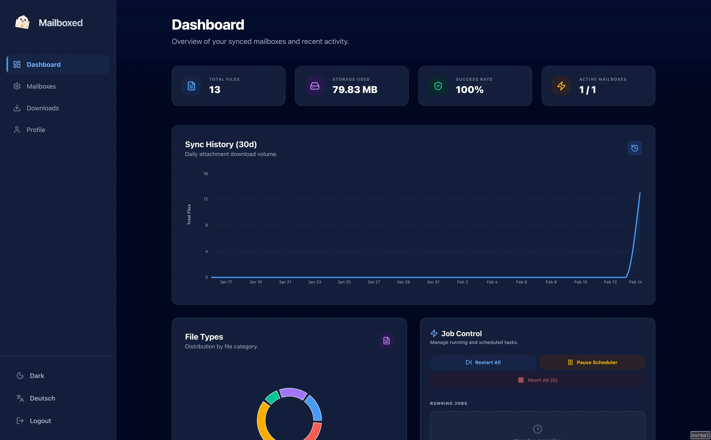
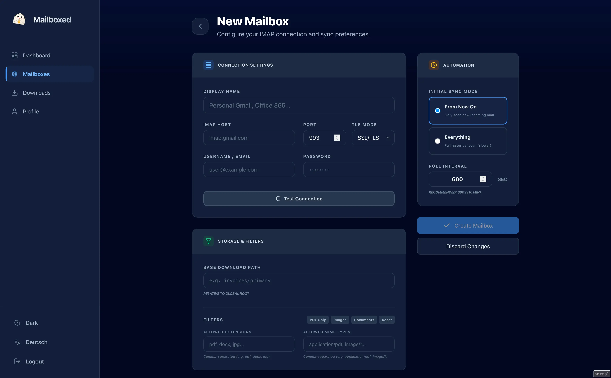

# Mailboxed


Mailboxed connects to one or more IMAP mailboxes, downloads email attachments (optionally filtered by type), saves them to a designated folder structure on disk, and keeps a complete record of what was downloaded and when.

# Screenshots





📖 **[Read the Documentation](https://fe-lix-werner.github.io/mailboxed/)**


## Features

- **Multi-mailbox Sync**: Connect multiple IMAP accounts.
- **Selective Downloads**: Filter by file extension, MIME type, or size.
- **Deduplication**: SHA-256 based file deduplication.
- **Checkpointing**: Resumes from the last processed message (Everything or From Now On).
- **Responsive UI**: Built with React 19 and Tailwind CSS.
- **Secure**: IMAP credentials encrypted at rest with AES-256-GCM.
- **Docker Ready**: Easy deployment with Docker Compose.

## Getting Started

### Prerequisites

- [Bun](https://bun.sh) (v1.x)
- Docker (for production deployment)

### Environment Variables

Create a `.env` file in the root directory:

```env
APP_SECRET=your-session-secret
IMAP_CRED_MASTER_KEY=64-character-hex-string
DB_PATH=mailboxed.sqlite
DOWNLOAD_ROOT=downloads
LOG_LEVEL=info
```

*Note: `IMAP_CRED_MASTER_KEY` and `APP_SECRET` are optional and will be automatically generated and stored in a `.secrets.json` file in the same directory as your database if not provided.*

### Installation & Development

1. Install dependencies:
   ```bash
   bun install
   ```

2. Initialize the database:
   ```bash
   bun db:push
   ```

3. Start the development server (Backend & Frontend):
   ```bash
   bun dev
   ```

Alternatively, you can start them separately:
- `bun dev:backend`
- `bun dev:frontend`

### Building for Production

To build the frontend:
```bash
bun build
```

## Production Deployment

### Docker (Recommended)

The easiest way to run Mailboxed is using the pre-built Docker image:

```bash
docker run -d \
  -p 3000:3000 \
  -v ./data:/data \
  -e APP_SECRET=your-secret \
  ghcr.io/YOUR_GITHUB_USERNAME/mailboxed:master
```

Replace `YOUR_GITHUB_USERNAME` with your GitHub username (lowercase).

### Docker Compose

Alternatively, use the provided `docker-compose.yml`:

```bash
docker-compose up -d
```

Volumes are mapped to `/data` in the container, which contains both the SQLite database and the downloaded attachments.

## Tech Stack

- **Backend**: Bun, Drizzle ORM, SQLite, ImapFlow, Croner, Pino.
- **Frontend**: React 19, Vite, TanStack Query, React Router, Tailwind CSS, Lucide Icons.
- **Security**: Argon2 (passwords), AES-256-GCM (IMAP credentials).

## License

MIT

---
*Documentation hosted at: [https://fe-lix-werner.github.io/mailboxed/](https://fe-lix-werner.github.io/mailboxed/)*
